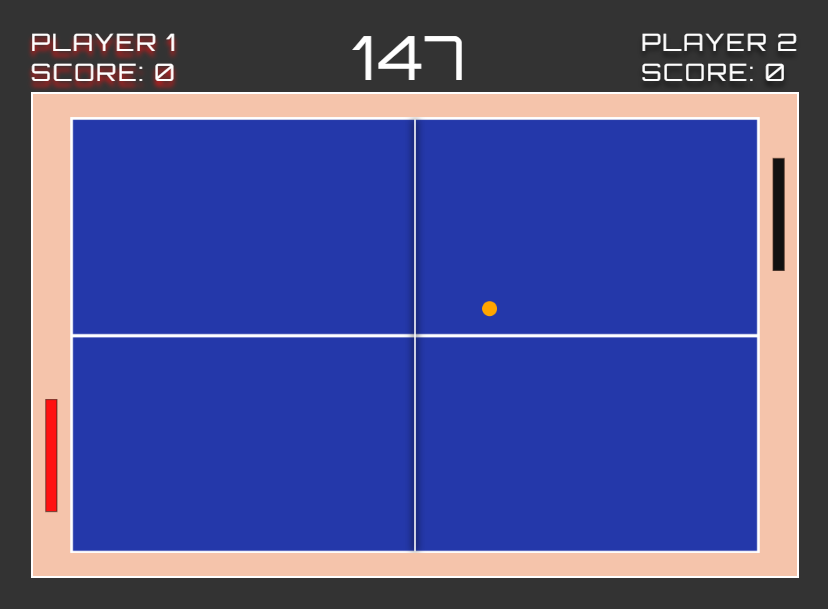

# 🏓 Ping Pong

A classic multiplayer game where each player tries to score points and outplay their opponent.
> 🖥️ This project is only compatible with computers (not compatible with mobile or touch devices).

---

## 🎯 Description

This project was built **from scratch** as part of my personal learning journey in software development.  
It's inspired by the classic *Ping Pong* game and helped me reinforce my knowledge of:

- HTML
- CSS
- JavaScript
- Canvas API
- Object-Oriented Programming (OOP)

In addition to the core gameplay, it includes:

- Main menu
- Sound effects
- Winning effects
- Keyboard-based controls

---

## 🎮 How to Play

1. Do not let the ball hit your side of the table!
2. Use the **keyboard** to control the game (movement, menu access, etc.).
3. For a full list of controls, and how-to play, open the **in-game menu** by pressing the **Spacebar**.

Enjoy the challenge and retro arcade feel!

---

## 🛠️ Technologies Used

- HTML5 + Canvas
- CSS3
- JavaScript (Vanilla)
- Object-Oriented Design

---

## ⚠️ Requirements

- **Computer only**
- Not compatible with mobile or touch devices
- Best experienced on **Chrome** or **Firefox**

---

## 👨‍💻 Author

Developed by **Jose Angel Gil**  
GitHub: [@joseangelgil](https://github.com/joseangelgil)

---

## 📷 Screenshot

